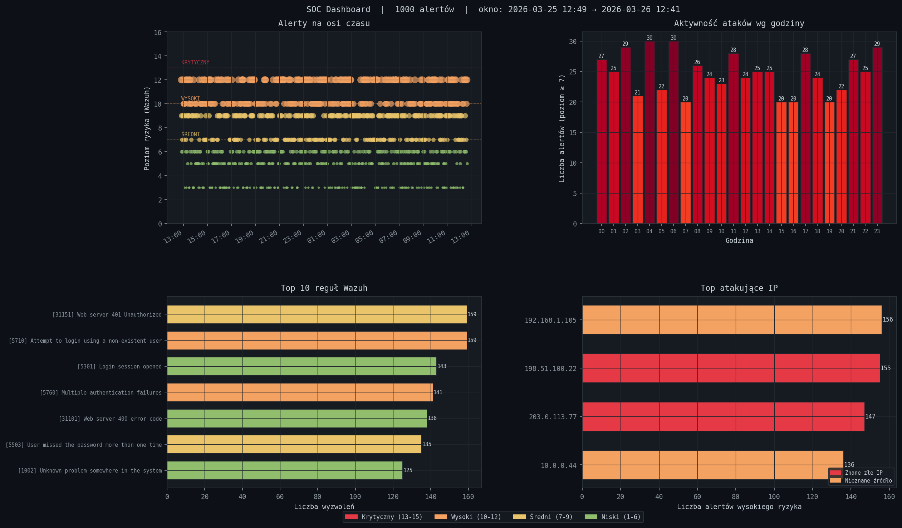

# SOC Home Lab

Projekt edukacyjny do nauki cyberbezpieczeństwa zbudowany na bazie Wazuh SIEM.
Każdy etap to niezależny moduł — razem tworzą mini-platformę SOC-analityczną.

Projekt powstał jako ćwiczenie praktyczne po pracy inżynierskiej z optymalizacji SIEM (Wazuh + Security Onion). Celem jest przełożenie umiejętności z analizy danych na realne narzędzia bezpieczeństwa.

---

## Postęp

- [x] **Etap 1** — Analizator logów (parser, brute-force detector, dashboard PNG, CLI)
- [x] **Etap 2** — Integracja z Wazuh API (mock serwer, klient REST, SQLite, poller)
- [ ] **Etap 3** — Threat Intelligence (AbuseIPDB, AlienVault OTX)
- [ ] **Etap 4** — Dashboard webowy (Streamlit)
- [ ] **Etap 5** — Automatyczna odpowiedź na incydenty (SOAR-lite)
- [ ] **Etap 6** — ML Anomaly Detection (Isolation Forest)

---

## Etap 1 — Analizator logów ✓

Parser i analizator logów Wazuh w Pythonie. Wykrywa ataki brute-force trzema
algorytmami korelacji zdarzeń i generuje dashboard wizualny. Działa w całości
lokalnie — nie potrzeba żadnego serwera.



### Wymagania

```bash
pip install -r requirements.txt   # pandas, matplotlib, python-dateutil
```

Python 3.10+. Brak niestandardowych zależności — działa na każdym PC, VM i RPi.

### Szybki start

```bash
cd etap1_log_analyzer

# 1. Wygeneruj testowe logi (1000 alertów, ostatnie 7 dni)
python soc.py generate

# 2. Analiza ogólna — statystyki, top reguły, top IP
python soc.py analyze

# 3. Wykryj ataki brute-force, password spraying i distributed attacks
python soc.py brute

# 4. Wygeneruj dashboard PNG (4 wykresy)
python soc.py chart

# 5. Wszystko naraz z eksportem CSV
python soc.py full --csv
```

Pełna lista komend: [KOMENDY.txt](etap1_log_analyzer/KOMENDY.txt)
Opis każdego pliku: [OPIS_PLIKOW.md](etap1_log_analyzer/OPIS_PLIKOW.md)

### Przykładowy wynik

```
────────────────────────────────────────────────────────────────────────
 ANALIZA LOGÓW  |  plik: sample_logs/wazuh_alerts.json
 Wczytano: 1000 alertów  |  poziom ≥7: 214
────────────────────────────────────────────────────────────────────────

 Top reguły (poziom ≥7):

  ███████████████   87x  [5710] sshd: Attempt to login non-existent user
  ██████████   53x  [5760] sshd: Multiple authentication failures
  ████████    42x  [31151] Web server directory traversal attempt

 Top atakujące IP:

  ██████████████   116x  91.108.4.200
  ████████    49x  198.51.100.22

[!!!] KRYTYCZNY | 2024-06-03 02:14 | Brute-force SSH
      agent=linux-server-01  ip=91.108.4.200  prób=34  ← UDANE LOGOWANIE!
```

### Filtry dat

Wszystkie komendy obsługują filtry czasowe:

```bash
# Ostatnie N godzin
python soc.py analyze --hours 24
python soc.py chart   --hours 48

# Konkretny zakres dat
python soc.py analyze --from 2024-06-01 --to 2024-06-07
python soc.py chart   --from "2024-06-01 08:00" --to "2024-06-01 20:00"

# Generator z konkretnym zakresem
python soc.py generate --from 2024-06-01 --to 2024-06-07 --count 2000
```

### Struktura plików

```
etap1_log_analyzer/
├── soc.py                     ← główny punkt wejścia CLI
├── generate_sample_logs.py    ← generator realistycznych logów testowych
├── brute_force_detector.py    ← detekcja brute-force, spraying, distributed
├── visualizer.py              ← dashboard PNG (4 wykresy matplotlib)
├── parser.py                  ← wczytywanie i parsowanie logów JSON
├── rules.py                   ← filtrowanie alertów po poziomie i grupie
├── reporter.py                ← eksport wyników do CSV
├── main.py                    ← standalone analiza bez CLI
└── sample_logs/               ← dane testowe (nie w git)
```

### Algorytmy detekcji

Trzy algorytmy oparte na sliding window — tym samym mechanizmie który stosuje
Splunk, Elastic SIEM i reguły Sigma:

- **Brute-force** — okno 60s, ≥5 nieudanych prób z jednego IP na jeden host.
  Automatycznie wykrywa udane logowanie po ataku i eskaluje severity do KRYTYCZNY.
- **Password spraying** — okno 300s, jeden IP próbuje ≥3 różnych użytkowników.
  Wykrywa powolne ataki omijające blokady kont których klasyczny licznik nie złapie.
- **Distributed attack** — okno 300s, ≥3 różne IP atakują tego samego użytkownika.
  Wykrywa skoordynowane ataki botnetowe gdzie każde IP wygląda niewinnie z osobna.

### Dashboard

| Wykres | Co pokazuje |
|---|---|
| Timeline alertów | Każdy alert jako kropka na osi czasu — skupienia = ataki |
| Heatmapa godzinowa | O której godzinie jest szczyt ataków |
| Top 10 reguł | Które reguły Wazuha wyzwalają się najczęściej |
| Top atakujące IP | Kandydaci do blokady przez iptables |

### Powiązania MITRE ATT&CK

| Scenariusz | Technika |
|---|---|
| Brute-force SSH | T1110.001 — Password Guessing |
| Password spraying | T1110.003 — Password Spraying |
| Web scan / SQLi | T1595 — Active Scanning |
| Privilege escalation sudo | T1548.003 — Sudo Caching |
| File integrity violation | T1565 — Data Manipulation |

---

## Etap 2 — Wazuh API + SQLite ✓

Klient REST API dla Wazuh Managera z lokalną bazą SQLite i automatycznym
pollerem. Etap 2 można testować w całości lokalnie bez żadnego serwera —
mock serwer symuluje pełne API Wazuha v4.x.

### Szybki start (dwa terminale)

**Terminal 1 — mock serwer:**

```bash
cd etap2_wazuh_api
python mock_wazuh_server.py
```

**Terminal 2 — zbieranie alertów:**

```bash
# Zbieraj alerty co 5 sekund
python soc2.py poll

# Tylko alerty wysokiego ryzyka, co 10 sekund
python soc2.py poll --level 7 --interval 10

# Status bazy i API
python soc2.py status

# Przeszukaj zebrane dane
python soc2.py query --level 10
python soc2.py query --ip 91.108.4.200 --format summary
python soc2.py query --agent linux-server-01

# Lista agentów
python soc2.py agents
```

Pełna lista komend: [KOMENDY_ETAP2.txt](KOMENDY_ETAP2.txt)

### Połączenie Etapu 1 i 2

Dane zebrane przez poller można analizować narzędziami z Etapu 1:

```bash
# Eksportuj zebrane alerty do JSON
python soc2.py query --level 0 --format json --limit 9999 > zebrane.json

# Analizuj narzędziami z Etapu 1
cd ../etap1_log_analyzer
python soc.py analyze --input ../etap2_wazuh_api/zebrane.json
python soc.py brute   --input ../etap2_wazuh_api/zebrane.json
python soc.py chart   --input ../etap2_wazuh_api/zebrane.json --output dashboard_live.png
```

### Przejście na prawdziwy Wazuh

Gdy masz serwer z Wazuhem — jedna zmiana w komendzie:

```bash
# Mock (testowanie lokalne)
python soc2.py poll --host 127.0.0.1

# Prawdziwy Wazuh Manager
python soc2.py poll --host 192.168.1.50 --password TWOJE_HASLO
python soc2.py agents --host 192.168.1.50
python soc2.py status --host 192.168.1.50
```

Cały kod — klient, baza, poller, CLI — zostaje bez zmian.

### Struktura plików

```
etap2_wazuh_api/
├── soc2.py                ← CLI: poll / status / query / agents
├── mock_wazuh_server.py   ← symuluje Wazuh REST API v4.x (do testów lokalnych)
├── wazuh_client.py        ← klient HTTP z auto-refresh tokenu JWT
├── alert_store.py         ← lokalna baza SQLite z deduplikacją po ID
└── poller.py              ← pętla zbierająca alerty co X sekund
```

### Architektura

```
[Mock serwer / RPi z Wazuhem]
        │  REST API (JWT)
        ▼
  wazuh_client.py          ← autentykacja, GET /alerts, GET /agents
        │
        ▼
  alert_store.py           ← SQLite, INSERT OR IGNORE (deduplikacja)
        │
        ▼
  soc2.py query            ← filtrowanie po dacie, IP, agencie, poziomie
        │
        ▼
  soc.py analyze/chart     ← analiza i wizualizacja z Etapu 1
```

---

## Stack technologiczny

| Warstwa | Technologia |
|---|---|
| SIEM | Wazuh v4.x |
| Język | Python 3.10+ |
| Analiza | pandas, matplotlib |
| Baza danych | SQLite (wbudowana w Python) |
| Detekcja | sliding window (własna implementacja) |
| API client | urllib (wbudowana w Python, bez requests) |

---

## Wymagania

```
pandas>=2.0.0
matplotlib>=3.8.0
python-dateutil>=2.8.2
requests>=2.31.0        # przygotowane pod Etap 3

# Etap 2 nie wymaga dodatkowych bibliotek — używa tylko stdlib Pythona
# (urllib, sqlite3, json, http.server)
```

```bash
pip install -r requirements.txt
```

