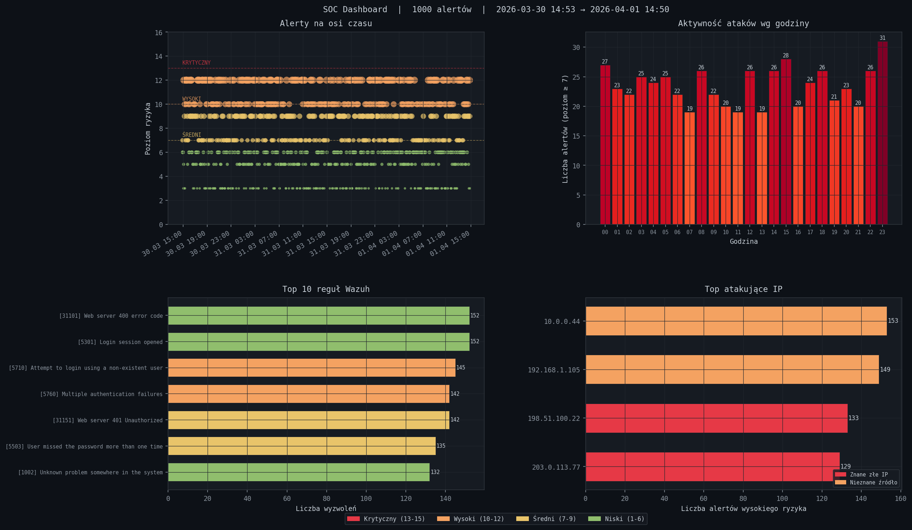

# SOC Home Lab

Projekt edukacyjny do nauki cyberbezpieczeństwa zbudowany na bazie Wazuh SIEM.
Każdy etap to niezależny moduł — razem tworzą mini-platformę SOC-analityczną.

Projekt powstał jako ćwiczenie praktyczne po pracy inżynierskiej z optymalizacji SIEM (Wazuh + Security Onion). Celem jest przełożenie umiejętności z analizy danych na realne narzędzia bezpieczeństwa.

---

## Etap 1 — Analizator logów ✓

Parser i analizator logów Wazuh w Pythonie. Wykrywa ataki brute-force trzema algorytmami korelacji zdarzeń i generuje dashboard wizualny.



### Uruchomienie

```bash
pip install -r requirements.txt

# Wygeneruj testowe logi
python soc.py generate

# Analiza ogólna
python soc.py analyze

# Wykryj ataki brute-force
python soc.py brute

# Dashboard PNG
python soc.py chart

# Wszystko naraz
python soc.py full --csv
```

Pełna lista komend w pliku [KOMENDY.txt](KOMENDY.txt).
Szczegółowy opis każdego pliku w [OPIS_PLIKOW.md](OPIS_PLIKOW.md).

### Przykładowy wynik

```
────────────────────────────────────────────────────────────────────────
 ANALIZA LOGÓW  |  plik: sample_logs/wazuh_alerts.json
 Wczytano: 1000 alertów  |  poziom ≥7: 214
────────────────────────────────────────────────────────────────────────

 Top reguły (poziom ≥7):

  ███████████████   87x  [5710] sshd: Attempt to login non-existent user
  ██████████   53x  [5760] sshd: Multiple authentication failures
  ████████    42x  [31151] Web server directory traversal attempt

 Top atakujące IP:

  ██████████████   116x  91.108.4.200
  ████████    49x  198.51.100.22

[!!!] KRYTYCZNY | 2024-06-03 02:14 | Brute-force SSH
      agent=linux-server-01  ip=91.108.4.200  prób=34  ← UDANE LOGOWANIE!
```

### Pliki

```
etap1_log_analyzer/
├── soc.py                     ← główny punkt wejścia CLI
├── generate_sample_logs.py    ← generator realistycznych logów testowych
├── brute_force_detector.py    ← detekcja brute-force, spraying, distributed
├── visualizer.py              ← dashboard PNG (4 wykresy matplotlib)
├── parser.py                  ← wczytywanie i parsowanie logów JSON
├── rules.py                   ← filtrowanie alertów po poziomie i grupie
├── reporter.py                ← eksport wyników do CSV
├── main.py                    ← standalone analiza bez CLI
└── sample_logs/               ← dane testowe (nie w git)
```

### Algorytmy detekcji

Trzy algorytmy oparte na **sliding window** — tym samym mechanizmie który stosuje Splunk, Elastic SIEM i reguły Sigma:

**Brute-force** — okno 60s, ≥5 nieudanych prób z jednego IP na jeden host. Automatycznie wykrywa udane logowanie po ataku i eskaluje do KRYTYCZNY.

**Password spraying** — okno 300s, jeden IP próbuje ≥3 różnych użytkowników. Wykrywa powolne ataki omijające blokady kont których klasyczny licznik nie złapie.

**Distributed attack** — okno 300s, ≥3 różne IP atakują tego samego użytkownika. Wykrywa skoordynowane ataki botnetowe gdzie każde IP wygląda niewinnie z osobna.

### Dashboard

Cztery wykresy w jednym pliku PNG:

| Wykres | Co pokazuje |
|---|---|
| Timeline alertów | Każdy alert jako kropka na osi czasu — skupienia = ataki |
| Heatmapa godzinowa | O której godzinie jest szczyt ataków |
| Top 10 reguł | Które reguły Wazuha wyzwalają się najczęściej |
| Top atakujące IP | Kandydaci do blokady przez iptables |

### Powiązania MITRE ATT&CK

| Scenariusz | Technika |
|---|---|
| Brute-force SSH | T1110.001 — Password Guessing |
| Password spraying | T1110.003 — Password Spraying |
| Web scan / SQLi | T1595 — Active Scanning |
| Privilege escalation sudo | T1548.003 — Sudo Caching |
| File integrity violation | T1565 — Data Manipulation |

---

## Kolejne etapy

- [ ] **Etap 2** — Integracja z Wazuh API (live feed zamiast pliku)
- [ ] **Etap 3** — Threat Intelligence (AbuseIPDB, AlienVault OTX)
- [ ] **Etap 4** — Dashboard webowy (Streamlit)
- [ ] **Etap 5** — Automatyczna odpowiedź na incydenty (SOAR-lite)
- [ ] **Etap 6** — ML Anomaly Detection (Isolation Forest)

Etap 2 wymaga Raspberry Pi lub innego serwera z Wazuh Managerem.
Przejście z pliku na API to jedna zmiana: `load_wazuh_logs()` → `fetch_from_wazuh_api()`.

---

## Stack technologiczny

| Warstwa | Technologia |
|---|---|
| SIEM | Wazuh |
| Język | Python 3.10+ |
| Analiza | pandas, matplotlib |
| Detekcja | algorytmy sliding window (własna implementacja) |
| Sprzęt (Etap 2+) | Raspberry Pi 5 8GB + Ubuntu 22.04 |

---

## Wymagania

```
pandas>=2.0.0
matplotlib>=3.8.0
python-dateutil>=2.8.2
requests>=2.31.0
```

```bash
pip install -r requirements.txt
```

Python 3.10 lub nowszy. Brak zewnętrznych zależności poza standardowymi bibliotekami
naukowymi — działa lokalnie, na VM i na RPi bez dodatkowej konfiguracji.

